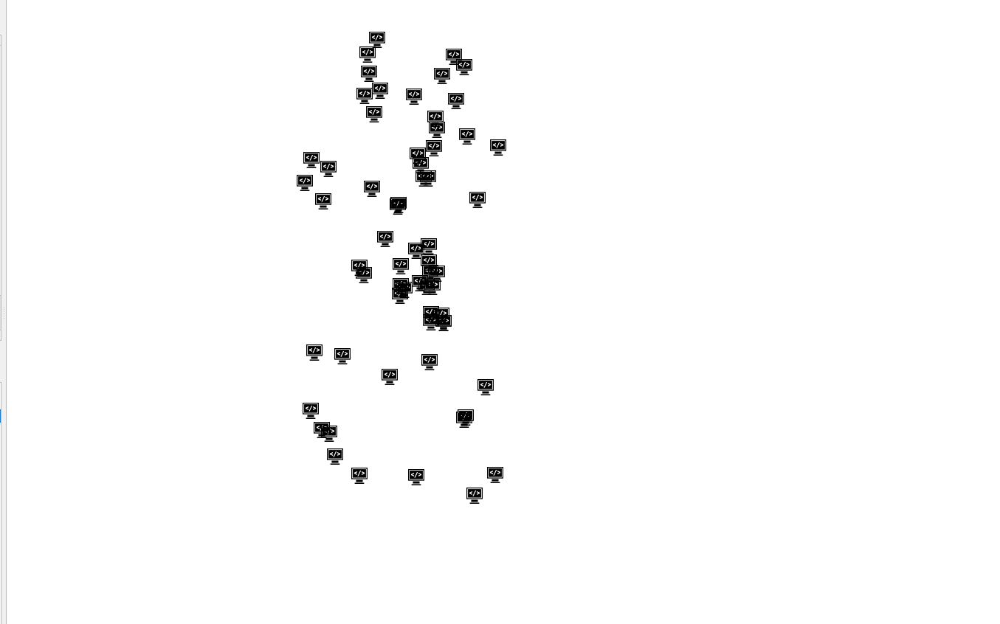
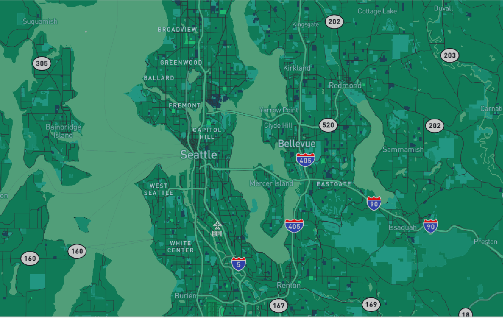

# geog458lab4
* NOTE: added imgs folder for readme file
* NOTE: Not sure is the points layer is considered a thematic layer you were looking for but I believe it still reflects my understanding of what was required for this lab.

# Introduction
The examined geographic area is centered around University of Washington, but more broadly Seattle in Washington.  
Here is a direct [link](https://kingsolomonk.github.io/geog458lab4/) to the maps! (https://kingsolomonk.github.io/geog458lab4/)

# Screenshots
* NOTE: **ALL LAYERS HAVE 1-14 ZOOM LEVELS, AND WERE SET AT 1:220000 SCALE IN QGIS** 

Base Layer 
 
One of MapBox's Navigation-Night themed layers.

Hacker Points Layer 
 
This layer is the thematic layer, set of points that show hacking-related crimes recorded by the Seattle PD. Dataset was acquired from the Seattle data portal.
 Data Source: seattle.gov

Hackers Layer 
 
This layer is the combination of the base and points layer, creating the first layer opotion "hackers" for the web map.

Evergreen Layer 
 
This layer is a custom evergreen themed layer that I thought of because we are in the PNW.

